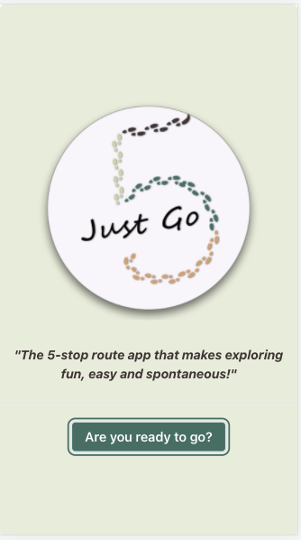
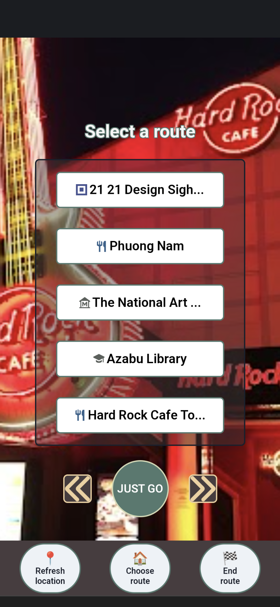
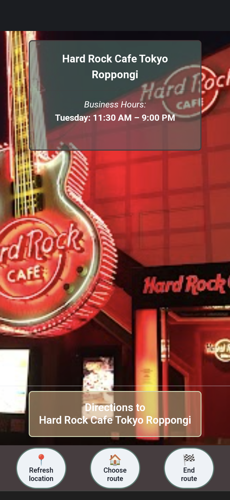
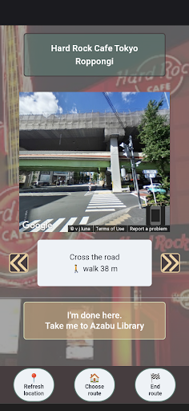
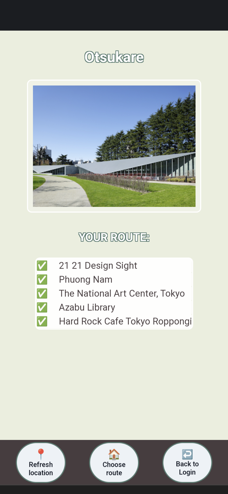

<br />
<div align="center">
  <a href="https://github.com/brianlee9090/CC24-seniorprojectfront">
    
  </a>
<h3 align="center">Just GO</h3>
</div>

### Description

Just GO is a user-friendly, innovative web application that allows users explore local areas using geolocation to find places recommended by locals.  
  
The motivation behind this project was to provide both travelers and visitors a curated, 5 stop location itinerary that allows users to explore and get to know local neighborhoods. The app's primary focus is to provide users with a manageable itinerary that can be accomplished in less than a day. To alleviate the stress of navigating through an unknown area, the app includes three key functionalities to assist the user getting from location to location: geolocation, real-time street view, and user-friendly directions.   Currently, the app is specific to the Tokyo Roppongi area, but with goals to expand to more locations.   

The key feature of 'Just GO' is to provide the user with the ability to navigate an unknown area by:  
(1) accessing the users geolocation;  
(2) updating the user's geolocation to provide a real-time street view as they navigate through a neighborhood;  
(3) provide the user with up-to-date directions as their geolocation changes

### How to use Just GO
The web version of the app is hosted [here](https://cc-24-seniorprojectfront-63tgc340b-brianlee9090.vercel.app/).  

- When users open Just GO, they are presented with a screen featuring the app logo, and a buttton which turns green once the user's geolocation is updated and the connection with the server is established.    
<a href=""></a>  
- On the next page, the users can select one of the several routes, by clicking left and right on the arow buttons on the bottom of the screen. Once the user has decided on a route, they can click the 'Just GO' button and they will be directed to the first place in the selected route.  
<a href=""></a>  
- On this page, the users can confirm the name of the place and whether the place is open or not on that day. If they like the place, the users can click on the 'Directions to ...' button, in order to see how they can get there.    
<a href=""></a>
-  On the navigation page, the users can see step-by-step instructions on how to get to the selected place, by clicking on the left and right arrows. As they navigate through the instructions, the street-view image will update simultanously. At any point, the user can click on the 'Refresh location' at the bottom of the screen, and the directions will be updated to start from their current location.  
After the user has reached the destination, they can select the 'I'm done here"...' button to be directed to the next place in the route.  
<a href=""></a>  
- At the end of the route, the users are presented with a list of the places they have visited that day. They can also finish a route early, by selecting the 'End Route' button on the bottom of the screen.  
<a href="">
</a>

### Project presentation & demo
Please watch out presentation on [Youtube](https://www.youtube.com/watch?v=iNLA8MqJN6A&t=8s&ab_channel=CodeChrysalis%5B%E3%82%B3%E3%83%BC%E3%83%89%E3%82%AF%E3%83%AA%E3%82%B5%E3%83%AA%E3%82%B9%5D).

### Backend repository
The backend repository for this app can be found [here](https://github.com/brianlee9090/CC24-seniorprojectback).  

### Getting Started 
For optimal results, please make sure that the Node.js version on your local machine is `v16.13.2` or above.  

- Clone the repositories:  
    - frontend:  ```git clone https://github.com/brianlee9090/CC24-seniorprojectfront```
    - backend repo:  ```git clone https://github.com/brianlee9090/CC24-seniorprojectback```
- Install npm packages: `npm install`
- Start frontend:  `npm run dev`
- Start backend: `npm start:dev`

### Tech-stack:

This project uses the React and Next.js frameworks. Next.js provides various features to optomize production: hybrid & static server rendering, Typescript support, smart bundling, route pre-fetching, and more with no config needed. As for design, we incorporated the Chakra UI component library to build our React application.   

- [React.js](https://reactjs.org/) 
- [Next.js](https://nextjs.org/)
- [Chakra UI](https://chakra-ui.com/)
- [Typescript](https://www.typescriptlang.org/)
- Deployment: [Vercel](https://vercel.com/)

### Contributors
- Project tech lead: [Brian Lee](https://github.com/brianlee9090)
- Frontend developer: [Ana Scuturici](https://github.com/AnaScuturici)
- Fullstack developer & technologist: [Wesley Lee](https://github.com/leewes5928)
- Fullstack developer: [Richard Beavis](https://github.com/richardpbCC)
- Fullstack developer: [Roman Montoya](https://github.com/Roman4u)

### Acknowledgements
This project was developed during our time as students at [Code Chrysalis](https://www.codechrysalis.io/).  
A big thank you to our instructors, the staff and our cohort mates at CC for all the support during the development of our app.  

### Contributing  
If you have a suggestion that would make our app better, please fork the repo and create a pull request. You can also simply open an issue with the tag "enhancement".  
If you like our project, please give us a star! Thank you!